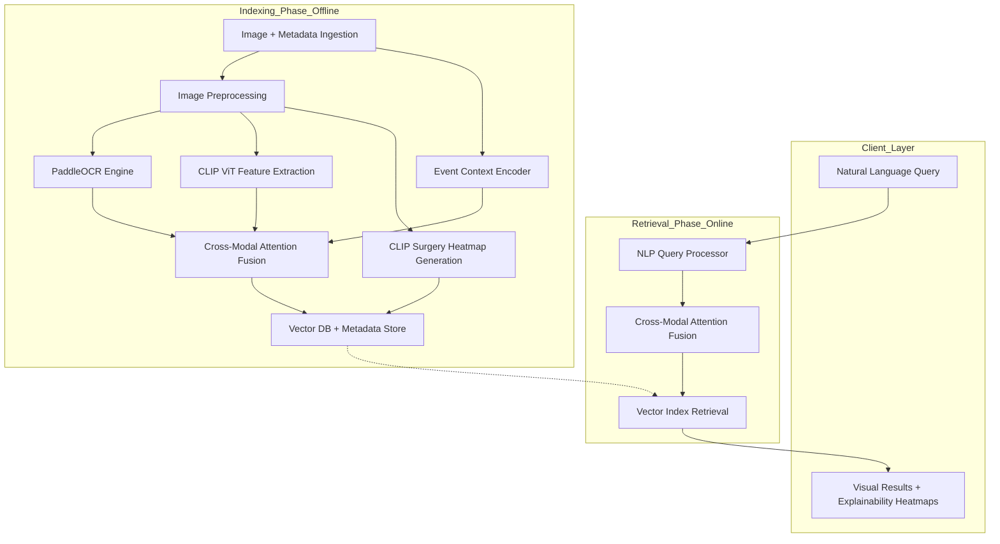

# EVIS (Event Visual Search) System Architecture

## 1. High-Level System Architecture

The EVIS system is designed to handle large-scale multimodal search with event-aware context and explainability.



## 2. Data Flow

### Indexing Phase (Offline)
1. **Ingestion**: Raw images and metadata (timestamps, geolocation, event names) are ingested.
2. **Preprocessing**: Images are resized/normalized for CLIP.
3. **Multimodal Extraction**:
    - **Visual**: CLIP ViT (B/16 or L/14) extracts image embeddings.
    - **Textual (OCR)**: PaddleOCR extracts text from images; text is encoded via CLIP Transformer.
    - **Explainability**: CLIP Surgery generates attention heatmaps for visual features relative to potential text anchors or general visual importance.
4. **Event Context**: Metadata is encoded into a fixed-size vector (Event Encoder).
5. **Fusion**: Visual, OCR-Text, and Event vectors are fused using a **Cross-Attention** mechanism to create a unified multimodal embedding.
6. **Storage**: Unified embeddings are stored in a Vector Database (e.g., Milvus/Qdrant) for millions-scale retrieval. Heatmaps are stored in a blob store (e.g., S3).

### Retrieval Phase (Online)
1. **Query Processing**: User enters a natural language query.
2. **Encoding**: Query is encoded via CLIP's Text Transformer.
3. **Fusion**: If the user provides additional context (e.g., "during Event X"), it's fused with the query embedding.
4. **Retrieval**: Top-K unified embeddings are retrieved from the Vector Index.
5. **Visualization**: System returns images and fetches pre-computed CLIP Surgery heatmaps to explain the match.

## 3. Data Schema

### Event Metadata Schema
```json
{
  "event_id": "UUID",
  "event_name": "String",
  "timestamp": "ISO8601",
  "location": {
    "lat": "Float",
    "lon": "Float",
    "address": "String"
  },
  "tags": ["String"]
}
```

### Vector Index Schema
| Field | Type | Description |
|-------|------|-------------|
| id | UUID | Primary key |
| image_path | String | Path to raw image |
| embedding | Vector(d) | Fused multimodal vector |
| event_id | UUID | Foreign key to Metadata Store |
| heatmap_path | String | Path to pre-computed explainability map |

## 4. Module Interfaces (APIs)

### Feature Extraction Module
`extract_visual_features(image: Bytes) -> Vector`
`extract_text_features(text: String) -> Vector`

### OCR Module (PaddleOCR)
`perform_ocr(image: Bytes) -> List[OCRResult]`

### Event Encoder
`encode_metadata(metadata: EventMetadata) -> Vector`

### Fusion Layer (Cross-Attention)
`fuse_modalities(visual, text, event) -> Vector`

### Search Module
`search(query_vector: Vector, top_k: Int) -> List[SearchResult]`

## 5. Explainable AI: CLIP Surgery Integration

- **Mechanism**: Use CLIP Surgery to resolve the "opposite visualization" problem in standard CLIP by utilizing a specialized attention mechanism that highlights specifically what the text-image match is based on.
- **Workflow**:
    1. During indexing, for each image, generate attention maps against a set of generic or domain-specific text descriptors.
    2. Alternatively, store the raw multi-head attention maps to enable more flexible online visualization (though pre-computing specific maps is preferred for performance at millions-scale).
    3. The heatmap will be overlaid on the original image in the UI to show the "hottest" regions contributing to the search result.
